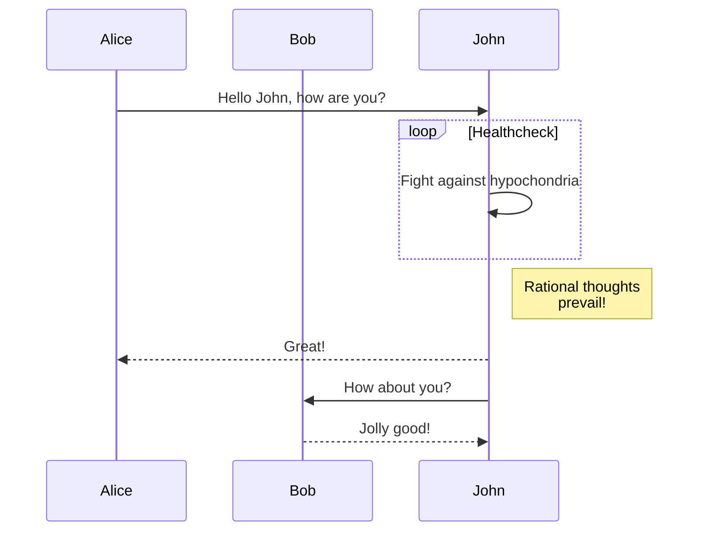

### 1. Mối quan hệ giữa hai khái niệm
*   **Machine Learning (ML)** là một lĩnh vực con của **Trí tuệ nhân tạo (AI)**.
*   **Deep Learning (DL)** lại là một lĩnh vực con nhỏ hơn và chuyên sâu hơn nằm trong **Machine Learning**. 
*   Vì vậy, mọi mô hình Deep Learning đều là Machine Learning, nhưng một mô hình Machine Learning chưa chắc đã là Deep Learning,.

### 2. Định nghĩa và Cách tiếp cận
*   **Machine Learning:** Tập trung vào việc giúp máy tính có khả năng **tự học hỏi từ dữ liệu** mà không cần phải được lập trình một cách cụ thể từng quy tắc. Thay vì con người định nghĩa sẵn các quy tắc (ví dụ: nếu giao dịch trên 100.000 USD từ nước ngoài thì là lừa đảo), ML sẽ tự phân tích dữ liệu cũ để tìm ra các đặc điểm và quy luật nhằm đưa ra dự đoán trong tương lai,.
*   **Deep Learning:** Sử dụng các thuật toán **lấy cảm hứng từ cấu trúc và chức năng của não bộ con người**, được gọi là **mạng thần kinh nhân tạo (Artificial Neural Network)**. Các mạng này bao gồm các đơn vị tính toán là các **neuron** được kết nối với nhau thành từng lớp để xử lý thông tin.

### 3. Sự khác biệt về kiến trúc và thuật ngữ
*   **Kiến trúc:** Deep Learning thường gắn liền với thuật ngữ **Neural Network (mạng thần kinh)**. Trong khi Deep Learning dùng để chỉ lĩnh vực nghiên cứu, thì Neural Network dùng để nói về cấu trúc dữ liệu gồm nhiều lớp neuron,.
*   **Đặc điểm nhận dạng:** Các mô hình Deep Learning thường phức tạp hơn và có khả năng xử lý các nhiệm vụ đòi hỏi "độ sâu" cao hơn so với các thuật toán Machine Learning truyền thống.

### 4. Ứng dụng tiêu biểu
*   **Machine Learning:** Thường được dùng trong các bài toán như dự đoán nhiệt độ, dự đoán bệnh tật dựa trên các đặc trưng (features) cụ thể, hoặc phân loại giao dịch ngân hàng,,.
*   **Deep Learning:** Là "trái tim" của những ứng dụng AI nổi bật và hiện đại nhất những năm gần đây như **ChatGPT** (xử lý ngôn ngữ tự nhiên) hay **Midjourney** (tạo ảnh nghệ thuật). Ngoài ra, nó còn mạnh mẽ trong lĩnh vực **thị giác máy tính (Computer Vision)** như nhận diện vật thể, phân đoạn hình ảnh,.




```js
/**
 * Extracts the title from a markdown file, checking frontmatter first, then the first H1 hearing.
 * @param {string} filePath - The path to the markdown file.
 * @returns {Promise<string|null>} The extracted title or null.
 */
async function getFileTitle(filePath) {
    try {
        const content = await fs.readFile(filePath, 'utf-8');
        const frontmatterRegex = /^---\s*\n([\s\S]*?)\n---\s*\n/;
        const match = content.match(frontmatterRegex);
        let body = content;

        if (match) {
            const data = yaml.load(match[1]);
            if (data && data.title) return pruneTitle(data.title);
            body = content.replace(frontmatterRegex, '');
        }

        // Fallback to first H1
        const headerMatch = body.match(/^#\s+(.+)$/m);
        if (headerMatch) return pruneTitle(headerMatch[1]);
    } catch (e) {
        // Ignore errors
    }
    return null;
}
```


**Tóm lại:** Machine Learning là phương pháp cho máy tính học từ dữ liệu nói chung, còn Deep Learning là một nhánh của nó nhưng sử dụng mô phỏng mạng thần kinh não bộ để giải quyết các vấn đề phức tạp hơn,.
